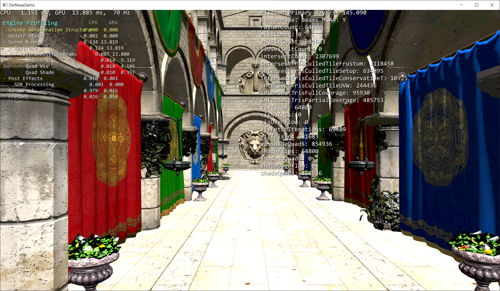

# D3D12 Raytracing MiniEngine Sample (Modified for beam tracing + MSAA)

## FRL Modifications: Beam Tracing + MSAA
Note, this sample has been modified to emulate conservative beam tracing queries, as well as demonstrate software MSAA via compute shaders.

It has been tested on an NVIDIA Titan RTX, driver 436.30. There are some assumptions in the shader code related to 32-wide SIMD, so it might not run properly on non-NVIDIA hardware.

### Settings
[Shaders/RayCommon.h](Shaders/RayCommon.h)
* QUAD_READ_GROUPSHARED_FALLBACK - set to 1 (default) to use groupshared memory to communicate between quad thread, 0 to use SM6.0 intrinsics
* EMULATE_CONSERVATIVE_BEAMS_VIA_AABB_ENLARGEMENT - set to 1 (default) to apply camera-dependent enlargement to beam tracing AABBs to simulate conservative beam queries via regular ray queries
* COLLECT_COUNTERS - set to 1 (default) to collect and display performance counters
* AA_SAMPLES_LOG2 - 0 = 1x, 1 = 2x, 2 = 4x, 3 = 8x, 4 = 16x AA (default). Must also update AA_SAMPLE_OFFSET_TABLE to match.
* AA_SAMPLE_OFFSET_TABLE - sampleOffset1x, sampleOffset2x, sampleOffset4x, sampleOffset8x, sampleOffset16x (default)
* TRIS_PER_AABB - how many triangles per leaf node? (default 1)
* default tile dimensions are 8x4 = 32 threads, some assumptions exist in the shaders that tile thread count == 32 == HW wave size

### Raster
Renders the scene using traditional VS + PS + single-sampled rasterization.

### Rays
[Shaders/RaysLib.hlsl](Shaders/RaysLib.hlsl)
Renders the scene using super-sampled ray tracing, like so:
1. raygeneration shader:
   1. width * height threads
   1. each thread creates AA_SAMPLES rays per thread
1. miss shader writes the clear color to the framebuffer
1. closesthit shader:
   1. fetches triangle attributes
   1. interpolates
   1. analytically computes derivatives
   1. shades
   1. stores per-sample results into the per-sample rays' payloads
1. raygeneration shader collects the AA_SAMPLES ray payloads, averages them, and stores to the framebuffer

### Beams + MSAA (default)
Renders the scene using conservative beam tracing and software MSAA, like so:
1. DXR flags:
   1. D3D12_RAYTRACING_GEOMETRY_TYPE_PROCEDURAL_PRIMITIVE_AABBS
   1. D3D12_HIT_GROUP_TYPE_PROCEDURAL_PRIMITIVE
   1. D3D12_RAYTRACING_GEOMETRY_FLAG_NO_DUPLICATE_ANYHIT_INVOCATION
1. raygeneration shader: [Shaders/BeamsLib.hlsl](Shaders/BeamsLib.hlsl)
   1. width / TILE_DIM_X * height / TILE_DIM_Y threads
   1. each thread represents a beam (an 8x4 pixel screen tile)
   1. AABBs are enlarged in a camera-dependent fashion so that a center ray will be guaranteed to hit all geometry that would have intersected the beam volume
1. miss shader is a no-op
1. intersection shader: [Shaders/BeamsLib.hlsl](Shaders/BeamsLib.hlsl)
   1. reads the current search tMax via RayTCurrent()
   1. fetches the triangles associated with the leaf node
   1. culls the triangles against the beam (tile) left/right/top/bottom frustum planes
   1. culls the triangles for backfacing and intersection-before-ray-origin (T < 0)
   1. culls the triangles against UVW (barycentric) interval overlap
      1. categorizes the tile as fully outside, fully inside, or partially overlapping vs the triangle
      1. also computes a conservative tMin and tMax for the triangle, which will be the T value of the triangle intersection at one of the four tile corners
   1. if the triangle's tile tMin is conservatively further away than the current search tMax, cull the triangle
   1. if the tile is fully inside the triangle, update the search tMax
      1. tMax = min(tMax, triangleConservativeTMax)
      1. (this triangle is an occluder for this tile)
   1. if the tile has full or partial overlap with the triangle, call ReportHit(current search tMax) to invoke the anyhit shader
1. anyhit shader: [Shaders/BeamsLib.hlsl](Shaders/BeamsLib.hlsl)
   1. appends the triangle ID to a per-tile triangle list
1. closesthit shader is disabled
1. visibility compute shader: [Shaders/BeamsVis.hlsl](Shaders/BeamsVis.hlsl)
   1. thread layout:
      1. width * height threads
      1. threadgroup size = TILE_SIZE
      1. one tile (beam) per threadgroup
      1. one pixel per thread
      1. threads are swizzled such that every 4 consecutive threads are a 2x2 screen quad
   1. tile threads cooperatively fetch and setup the tile triangle list into groupshared memory
      1. one triangle per thread
      1. per-tile triangle coverage interpolation parameters are pre-computed
   1. tile threads loop through the triangle list, one thread per pixel
      1. per-pixel triangle coverage interpolation parameters are pre-computed
      1. loop over each AA sample
         1. update per-sample nearestT and nearestID if sample intersection closer than prior intersections
         1. per-sample intersection is relatively cheap thanks to precomputing and interpolating parameters
         1. (essentially Z-buffering and constructing a triangle ID gbuffer)
   1. discard the per-sample, per-thread nearestT values
      1. we no longer need our "depth buffer" once we've found the nearest per-sample hit
   1. sort the per-sample, per-thread nearestIDs
   1. compact and merge the per-sample, per-thread nearestIDs across a 2x2 quad into a list of "shade quads"
      1. each shade quad contains triangle ID, quad XY position within the tile, and per-pixel lit sample count
   1. emit the shade quads to a per-tile list
1. shading compute shader: [Shaders/BeamsShade.hlsl](Shaders/BeamsShade.hlsl)
   1. thread layout:
      1. width * height threads
      1. threadgroup size = TILE_SIZE
      1. one tile (beam) per threadgroup
      1. threads are swizzled such that every 4 consecutive threads are a 2x2 screen quad
      1. thread mapping to pixel location is dynamic, depending on which shade quad work item the thread is consuming
   1. each set of 4 threads pulls one shade quad off the per-tile list
   1. each thread shades at the pixel center
      1. centroid sampling is possible, but would require additional information to be stored in the shade quad data structure
      1. derivatives are calculated via finite differencing with neighbor threads in the quad
   1. shading is accumulated into a groupshared tile-local framebuffer
   1. threads cooperate to emit the anti-aliased tile-local framebuffer to global memory

Beam volume queries and MSAA are somewhat independent of each other.

Beam volume queries are a modification to the behavior of traversal and intersection/anyhit. They can be conservative (the full beam extents, for scene queries) or not (beam extents are inset to contain only the enabled subsamples), though this is a software detail that should be left up to the app's raygeneration shader. The closesthit shader and a final intersection T value are less directly useful than they are with traditional ray tracing.

Both require adding a concept of ray footprint (extents). For beams, to define the beam volume, in addition to the existing origin + central direction you get from ray tracing. For MSAA, to convert the location of 2D normalized subsample offsets to 3D space. In this demo, the extents are implicit thanks to us rendering a simple, projected 2D grid of pixels. In more complicated examples (VR distortion correction, foveated rendering), the extents would need to be explicit.

It's likely best to leave MSAA as a software concept, with the support of beam queries to gather geometry intersecting the footprint. This way the developer can implement MSAA, or more creative uses (irregular foveated rendering patterns, decoupling of visibility and shading rate, etc.).

### New key bindings:
* R - cycle render mode from 16x MSAA beams (default) to 1x raster to 16x SSAA rays

### Limitations:
The camera viewpoint is locked at the initial position. This is because the AABBs in beam tracing mode are expanded in a camera-dependent fashion as part of beam emulation.

## Controls:
* forward/backward/strafe - left thumbstick or WASD (FPS controls).
* triggers or E/Q - camera up/down .
* right thumbstick or mouse - camera yaw/pitch.
* F - freeze/unfreeze camera. 
* right/left - cycle through pre-set camera positions.
* click left thumbstick or lshift - toggle slow movement.
* back button or backspace - open debug menu. 
* dpad or arrow keys - navigate debug menu.
* button or return - toggle debug menu item.
* dpad left/right or left/right arrow key - adjust debug menu values.

## Limitations:
 * An incorrect debug layer error message is outputted when run due to an issue in the debug layer on SM 6.0 drivers. This can be ignored. "D3D12 ERROR: ID3D12Device::CopyDescriptors: Source ranges and dest ranges overlap, which results in undefined behavior."

## Requirements
* Consult the main [D3D12 Raytracing readme](../../readme.md) for the requirements.
